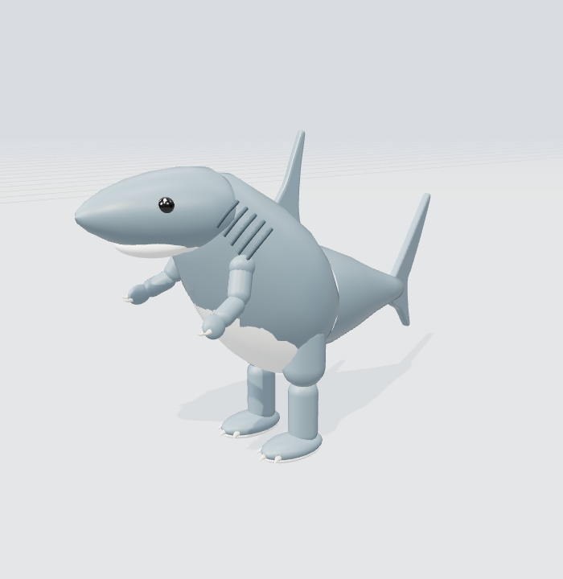
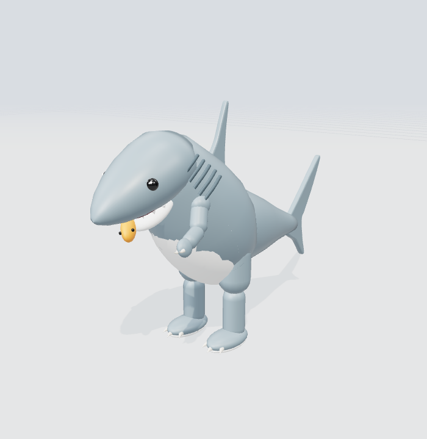
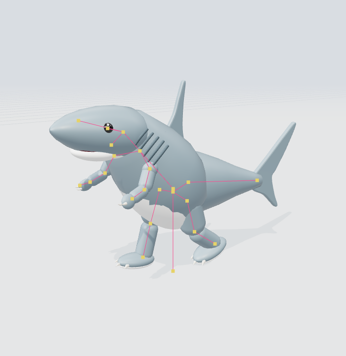
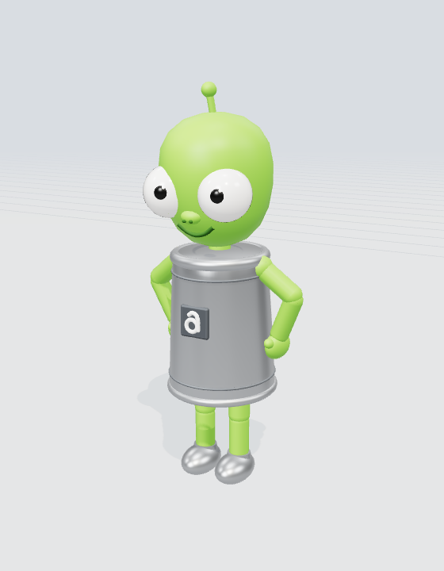
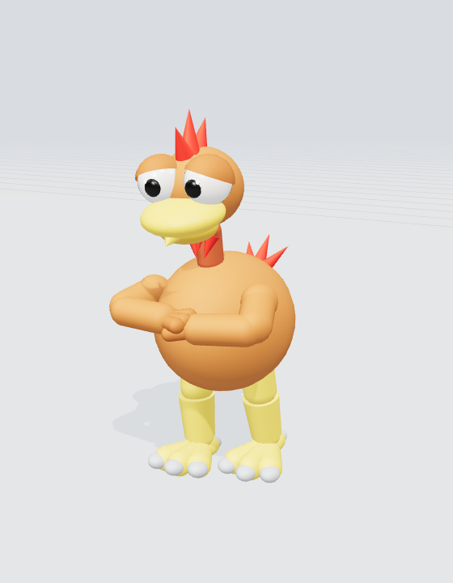
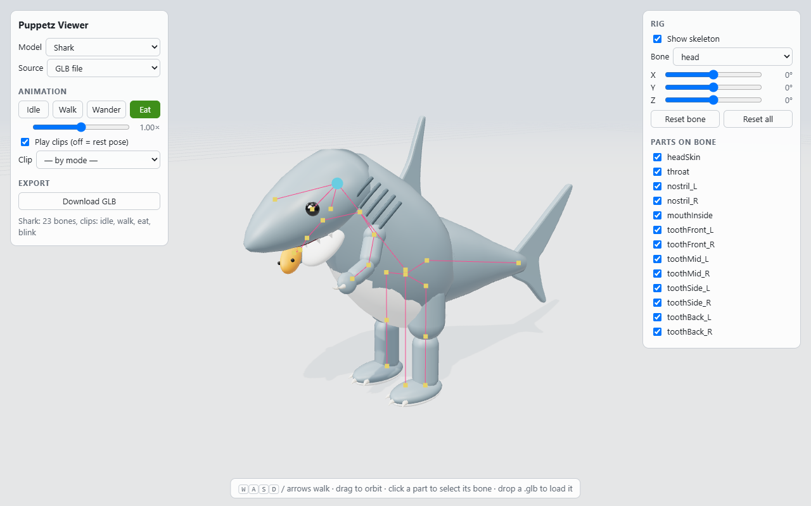
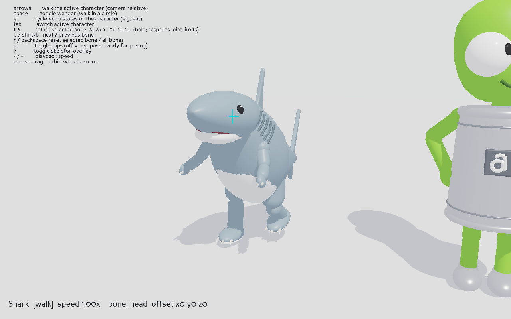
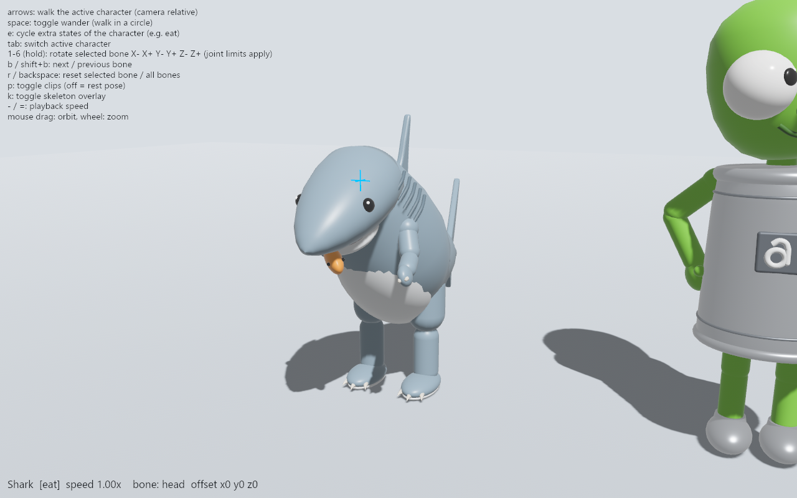

# Puppetz: data-driven jointed puppet characters

<p align="center">
  
  
  
</p>

Puppetz makes simple, toy-like 3D characters that work like **puppets**: rigid pieces on joints,
moved by code instead of strings. Each character is **described in JSON** and **built from
primitive shapes**, with a joint rig and procedural animations: idle, walk, blink. The same
description is used to:

- view, animate and pose the characters in the browser (three.js / WebGL)
- bake them into standard **GLB** files (glTF 2.0: nodes, PBR materials, animations)
- load the GLBs in game engines. The repo includes examples for **Panda3D** (Python) and **Bevy** (Rust)

The star of the project is the **Shark**, an original Puppetz character. He is a real-looking shark
who stands and walks like a dinosaur: a forward-leaning torpedo body, a pointed snout with an
underslung hinged jaw, gills, a dorsal fin, a long counterbalancing tail, short T-rex arms and
strong clawed legs. His **eat** animation brings a fish to his mouth; his arms are too short, so he
has to lean down to bite it. Two more sample
characters are included: **Alzák**, a green alien in a tin can, and a cartoon **chicken**.

**Humanoids.** RPG-style people are generated from a short recipe: a body (sex, age, height,
girth, skin, eyes) plus items from a library in slots: hair, beard, clothes, armor, gloves,
boots, headwear, cape or backpack, a weapon and a shield. Items are sized from the body, so any
item fits any character, and they layer (clothes, then armor, then a cape). Every humanoid can
idle, walk, run, talk, fight and attack, and shows six expressions (neutral, happy, sad,
agitated, angry, sleepy) on a separate face layer. Edit them live in the viewer's **Character**
panel. See [docs/humanoids.md](docs/humanoids.md).

<p align="center">
  
  
</p>

## Quick start

Requires Node.js 18+.

```sh
npm install           # three.js
npm run build:glb     # models/*/*.json -> models/*/*.glb
npm start             # http://localhost:8080
```

In the viewer:
- Switch model, and choose whether it is built live from **JSON** or loaded from the **GLB**.
- Play Idle / Walk / Wander, or any extra state the character has (the shark's **Eat**, a humanoid's Run / Talk / Combat / Attack), or walk with **WASD** or the arrow keys (**Shift** runs).
- Humanoids: pick an **Expression**, and change body and equipment in the **Character** panel (**Randomize**, **Save JSON**).
- Turn on **Show skeleton**, click a body part to select its joint, and rotate it with the X/Y/Z sliders.
- **Download GLB**, or **drop any .glb** onto the page to inspect and pose it.

Edit a model's JSON and reload the page with source "JSON" to see the change immediately. Run
`npm run build:glb` afterwards to update the GLB.

URL options: `?model=shark&source=glb&mode=eat` picks the model, source and state (`idle`, `walk`,
`wander` or any extra state); `&expr=happy` the expression; `&skeleton=1` shows the rig; `&ui=0`
hides the panels; `&t=1.0` jumps the animation forward (`&freeze=1` then holds that pose);
`&yaw=90` starts the camera at the character's side (0 = front); `&zoom=0.4&focus=skull` moves the
camera closer and aims it at a joint.

## Screenshots

<p align="center">
  
</p>

| Panda3D (Python) | Bevy (Rust) |
|---|---|
|  |  |

## Repository layout

```
index.html, src/app.js       web viewer (three.js from CDN)
src/rig/                     shared rig library (browser + Node)
  geometry.js                  primitive shapes: sphere, box, capsule, cone, torus, lathe, tube...
  textures.js                  procedural textures (fabric, leather, metal, wood, skin...)
  character.js                 JSON -> three.js scene graph + baked AnimationClips
  generators.js                recipe ({ "generator": ... }) -> character JSON
  humanoid.js                  humanoid generator: body, face, expressions, clips
  items.js                     the item library: clothes, armor, hair, hats, weapons, shields...
  controller.js                playback: crossfades, expressions, overlay clips, manual pose overrides
  exportGLB.js                 scene + clips -> GLB
tools/
  build-glb.mjs                npm run build:glb [id...]
  build-humanoid-schema.mjs    npm run build:schema (models/humanoid.schema.json from the item library)
  serve.mjs                    npm start (static server; browsers block fetch() on file://)
models/
  index.json                   list of characters (used by all viewers)
  character.schema.json        JSON Schema for character files
  humanoid.schema.json         JSON Schema for humanoid recipes (generated)
  <id>/<id>.json               character description (source of truth)
  <id>/<id>.glb                baked model (generated, committed for the engine examples)
examples/
  panda3d/                     Python + Panda3D viewer
  bevy/                        Rust + Bevy 0.18 viewer
docs/
  character-format.md          JSON and GLB structure reference
  creating-a-character.md      step-by-step guide to making your own animated character
  images/                      README pictures
LICENSE                      MIT
```

## Documentation

- **[docs/creating-a-character.md](docs/creating-a-character.md)**: start here to make a new character.
- **[docs/character-format.md](docs/character-format.md)**: every JSON field, and what ends up in the GLB.
- **[docs/humanoids.md](docs/humanoids.md)**: humanoid recipes, the item library and how to add items, textures, expressions.
- **[examples/README.md](examples/README.md)**: using the GLBs from Python or Rust.

## How it works, in one paragraph

A character is a hierarchy of **joints**: glTF nodes, rigid, with no skinning or deformation.
Each joint carries **parts**: primitive meshes with PBR materials. **Clips** are written as sine
waves or keyframes of rotation, position or scale *offsets* from the rest pose. The builder bakes
them into ordinary 30 fps keyframe tracks, so any glTF-capable engine can play them. Metadata the
engines need, such as which clip is idle or walk, the walk speed, always-on overlay clips and
joint limits, travels inside the GLB as glTF `extras`.

## Commands

| Command | Does |
|---|---|
| `npm start` | serve the viewer on http://localhost:8080 (`PORT=…` to change) |
| `npm run build:glb` | rebuild every GLB listed in `models/index.json` |
| `npm run build:glb -- chicken` | rebuild only the given ids |
| `npm run build:schema` | regenerate `models/humanoid.schema.json` after adding items |
| `npx ajv-cli@5 validate --spec=draft2020 -s models/character.schema.json -d "models/{shark,alzak,chicken}/*.json"` | validate the hand-written character files (humanoid recipes: `-s models/humanoid.schema.json`) |

## License

The code, tools, format and documentation are released under the [MIT License](LICENSE).

The **Shark** is an original Puppetz character and is covered by the MIT License like the rest of
the project.

The other two sample characters are simplified fan-made models inspired by existing mascots:
Alzák is the mascot of Alza.cz, and the chicken is styled after the *Moorhuhn* / *Crazy Chicken*
games. Those characters' names and likenesses belong to their respective owners and are **not**
covered by the MIT License. Use them as examples only, or replace them with your own characters.
